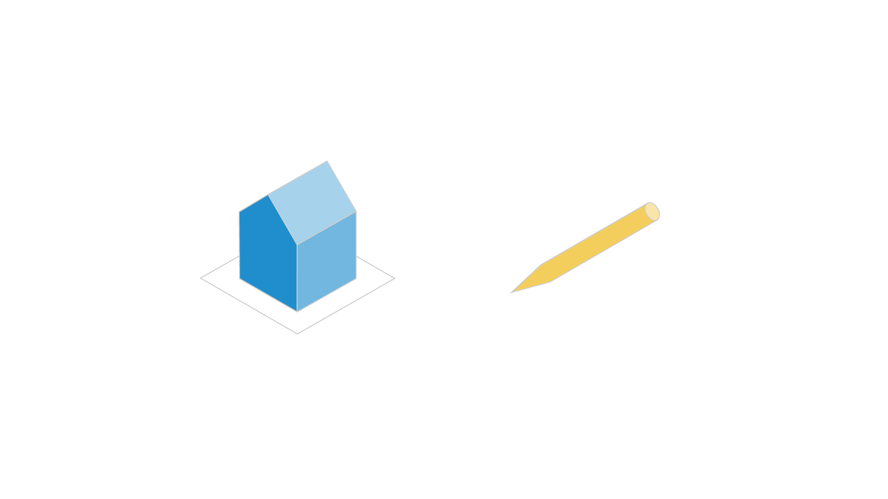
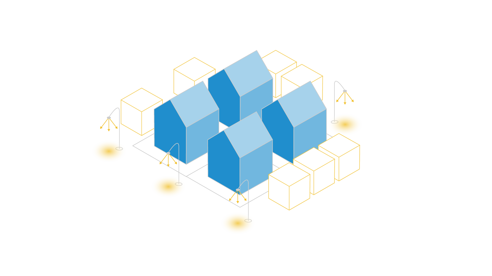
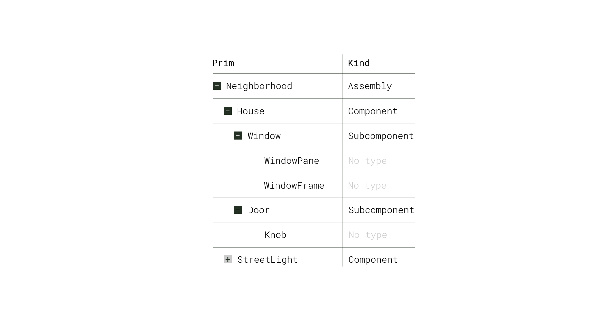

# Model Kinds

In this lesson, we'll explore the concept of kinds in OpenUSD.

## What are Model Kinds?


Model kinds are a piece of metadata that provide a way to organize and categorize different
types of scene elements or prims into a hierarchical structure.

Understanding kinds enables the creation of modular, reusable assets, and
employing them effectively can have a significant impact on how well we can
manage complex 3D scenes.


### How Does It Work?

Kinds are a set of predefined categories that define the role and behavior of
different prims within the scene hierarchy. These kinds include group,
assembly, and component. The base class for group and component kinds is
`Model`, which should not be assigned as any prim’s kind.




#### Component

To look at these kinds, let's start with component. A component is a reusable,
self-contained asset that is complete and referenceable. "Component" is a
relatively familiar word, so it’s helpful to think of component models as a
consumer-facing product like a pen or a house. While drastically different in
scale, both would be logical component models in a hierarchy.

#### Subcomponent

A component cannot contain other component models as descendants, which is why
we have subcomponents. Subcomponents aren't model kinds in the traditional
sense, but they are a way to identify that some prim within a component might
be important.




#### Groups and Assemblies

Zooming back out to the bigger picture, all parents of a component model must
have their kind metadata set to `group` or `assembly`. A group is an
organizational unit within a model, used to logically group related models
together. Similarly, an assembly, which is a subkind of group, serves as a
container for combining various parts or assets into a larger, more complex
entity. In the example of the house as our component, the neighborhood or city
might be assembly models. The assembly model may contain multiple group
scopes, such as trees and street lights in the neighborhood.




#### Model Hierarchy

Prims of the group, assembly, and component kind (and any custom kind
inheriting from them) make up the model hierarchy. This hierarchy is designed
so that we can better organize assets in our scene. It facilitates navigation,
asset management, and high-level reasoning about the scene structure.

We can leverage model hierarchy to prune traversal in the scenegraph. For
example, all ancestral prims of component models (when they’re correctly
grouped) are part of the model hierarchy, while all descendants are not.


### Working With Python


There are a few ways you can interact with model kinds using Python.

```python
# Construct a Usd.ModelAPI on a prim
prim_model_api = Usd.ModelAPI(prim)

# Return the kind of a prim
prim_model_api.GetKind()

# Set the kind of a prim
prim_model_api.SetKind(kind) 

# Return "true" if the prim repersents a model based on its kind metadata
prim_model_api.IsModel()  
```

## Key Takeaways

Model kinds in OpenUSD provide a structured way to organize and manage complex
3D scenes. By defining and adhering to these kinds, artists, designers, and
developers can create modular, reusable assets that can be easily combined,
referenced, and shared across different projects and workflows.
